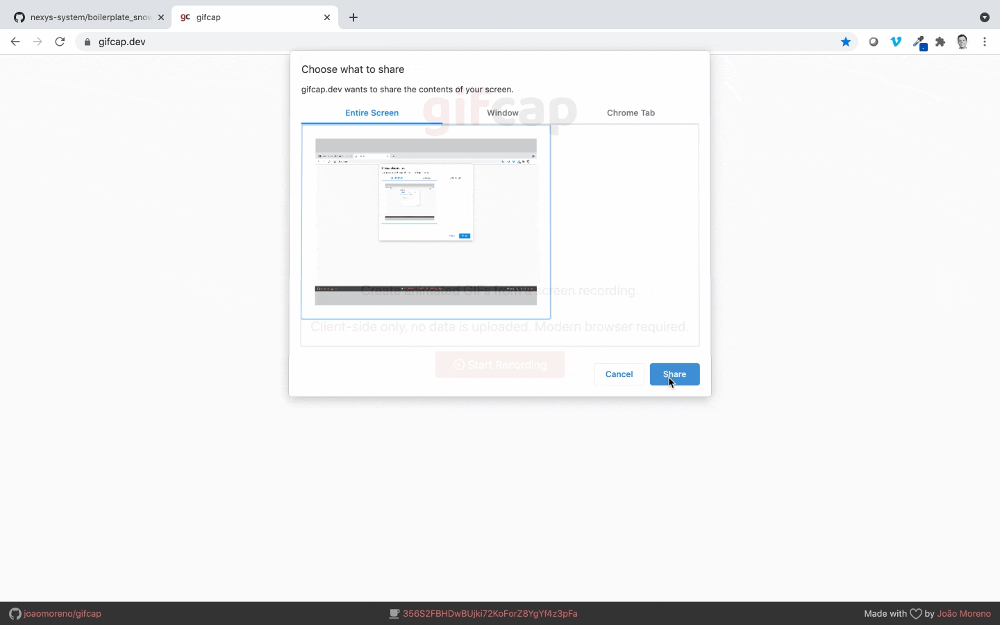

# Snowpack React Typescript Boilerplate with Bootstrap

## Get Started in < 1 min

This is a template repository. Follow the following steps to get started

- Use the button at the top to create your own repository based on this one.
- In your teminal
  -  clone the project locally: `git clone projectaddress`
  -  go into the project: `cd projectname`
  -  install dependencies `yarn`
  -  start project in watch mode: `yarn start`
- Go to `/src/config.ts` and adust to your needs
- A set of essential components is available at https://github.com/nexys-system/react-bootstrap-components and can be installed with `yarn add @nexys/react-bootstrap`

## Notes

- CI/CD is integrated with Github actions, make sure you change the badge reference in the readme so it points to your pipeline
- Deployment will fail if you don't provide a deployment key and the associated private key, see below
- Minimal set of dependencies
- The repository comes with an MIT license, make sure you adjust this based on your needs

## Deploy to GH-Page

In order for the project to deploy to GH-page automatically via Github actions, it is necessary for you to follow the next steps:
* In your terminal, generate a keypair: `ssh-keygen` (input a random name, say `mykey`) and press enter until process is completed
* In Github, go to `Settings` and then `Deploy Keys`. Paste `mykey.pub` and tick `Allow write access`  (the name is not important)
* In Github, go to `Settings` `Secrets`, `New repository Secret`. Paste `ACTIONS_DEPLOY_KEY`
